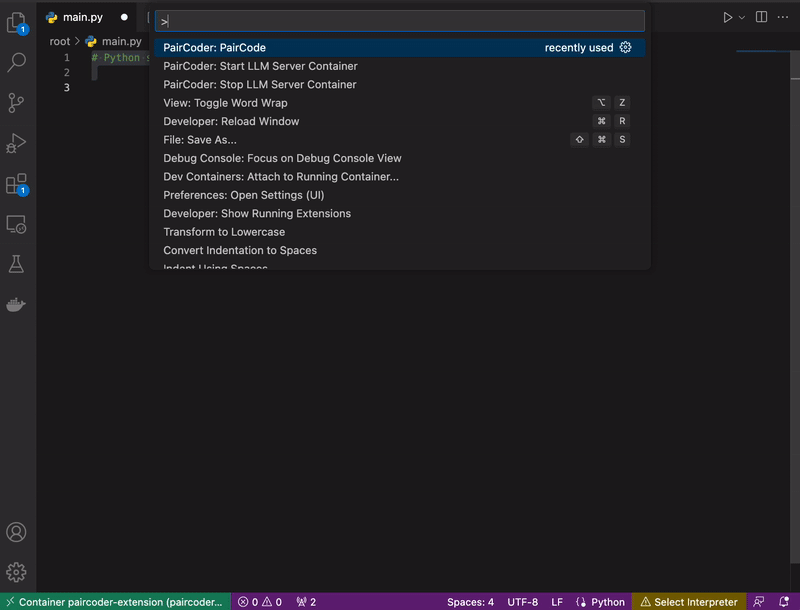

# PairCoder

Take your coding to the next level with AI while keeping privacy and confidentiality under your control.

You can run any arbitrary LLM model supported by [llama.cpp](https://github.com/ggerganov/llama.cpp) if
you choose to run the provided Docker container that this extension supports. Or build and use your own
 wrapper, which can run locally or remotely.
 
Use open models, or your own private models, finetuned to your individual or team data.

It won't compete with ChatGPT or GitHub Copilot anytime soon, but it balances that with the ownership advantage.

## Features

> For a quick start, it's recommended to use the supported container server. Ensure you have the LLM model binary
 to use. and [edit the settings accordingly](#settings). Then call `PairCoder: Start LLM Server Container` via the Command Palette.

Select any text and use the contextual menu or the Command Palette for code generation. **The prompt is the selected text.**

Starting a new generation will interrupt the current one. You can also interrupt at any time using `PairCoder: Stop PairCoding`
from the Command Palette.

## Requirements

- Docker if you choose to use the encapsulated container functionality (recommended).
- Binaries of the model(s) that will be used for code generation.

You can also run your own server (locally or remotely). The extension simply expects a REST API with a `/predict` `POST` endpoint. See the Github repository for details.

##  Settings

This extension contributes the following settings:

* `youcefrahal.paircoder.server.url`: URL of the LLM server. Default is `http://localhost:8399/predict`. Make sure to update the port number if you edit the `youcefrahal.paircoder.docker.port` setting.
* `youcefrahal.paircoder.docker.image`: The Docker image to use. Default is `yrahal/paircoder-server:<release>`.
* `youcefrahal.paircoder.docker.port`: Port to map the LLM server running in the container. Default is `8399`.
* `youcefrahal.paircoder.model.modelsPath`: Absolute path to a local folder containing one or more LLMs that can be ingested by `llama.cpp`.
* `youcefrahal.paircoder.model.filename`: Filename of the LLM to load. If unspecfifed, the first file found in the models folder will be used.
* `youcefrahal.paircoder.model.n_predict`: number of tokens to predict (default: 128, infinity: -1).

You should only have to edit `youcefrahal.paircoder.model.modelsPath` with your own value, and possibly `youcefrahal.paircoder.model.filename`
if you have more than one model in that folder.

You might have to edit `youcefrahal.paircoder.docker.port` if you have a port conflict (and therefore `youcefrahal.paircoder.server.url` too).

## Known Issues

* Parallel queries are unsupported but nothing prevents attempting them.
* Obviously, the speed and performance of the generation are dependent on the hardware and the model used. The above screenshot uses the base [GPT4All](https://github.com/nomic-ai/gpt4all) model. Vicuna 13B will give better results in general, but slower.

## Release Notes

### 0.0.1

- Ability to generate code or text using a local or a remote server.
- Integration of a container that serves `llama.cpp`, configurable to work with any of their supported models.

### 0.0.4

- A new command to interrupt prediction. Starting a new prediction will also interrupt the current one.
- A new option to customize the number of predicted tokens.
- By default, Docker images are now tied to the same release number as the extension.
